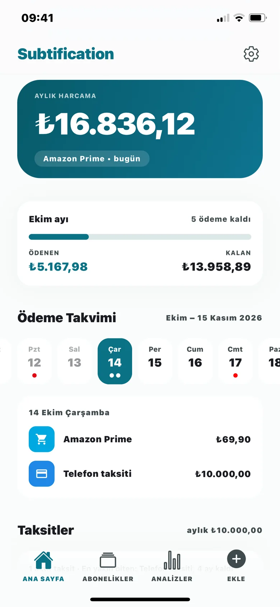
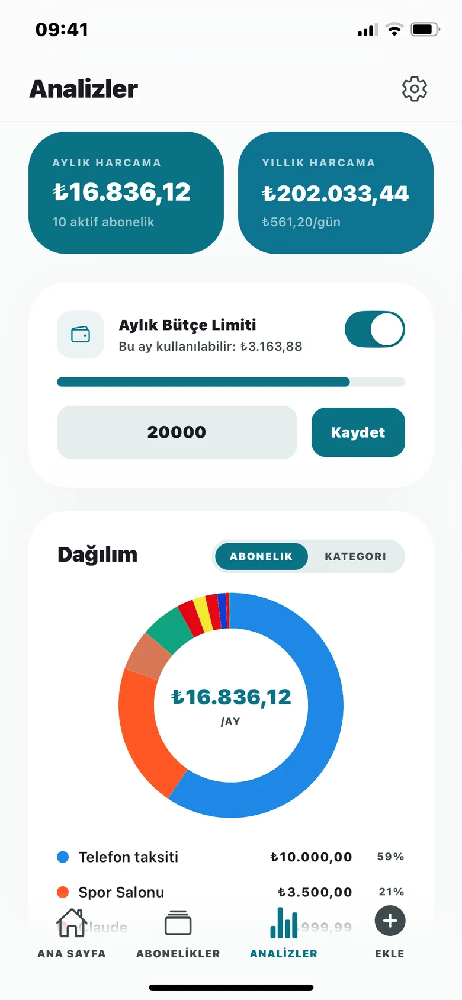
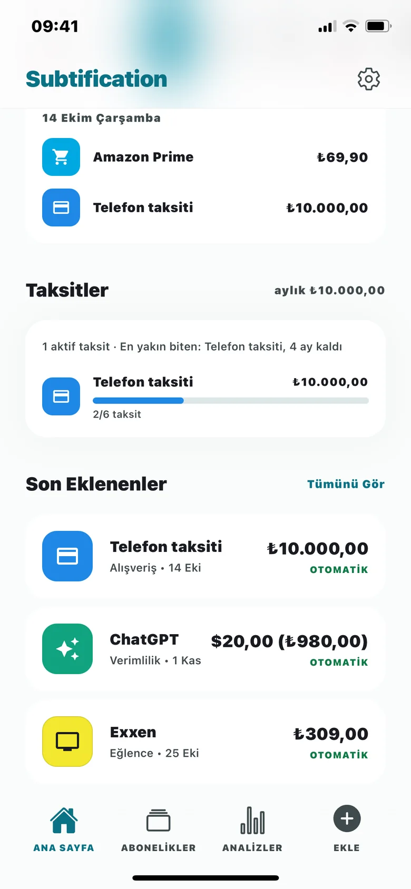
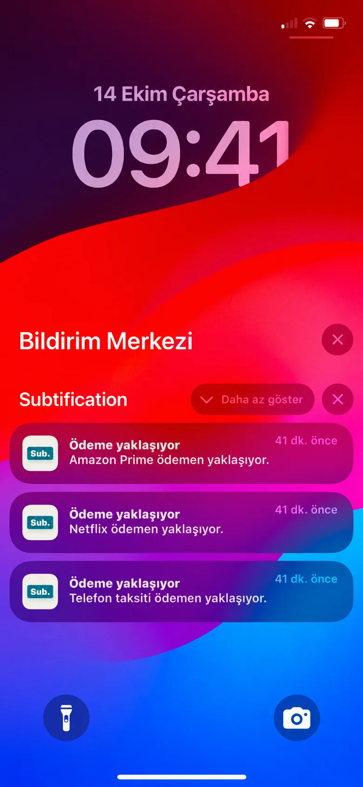
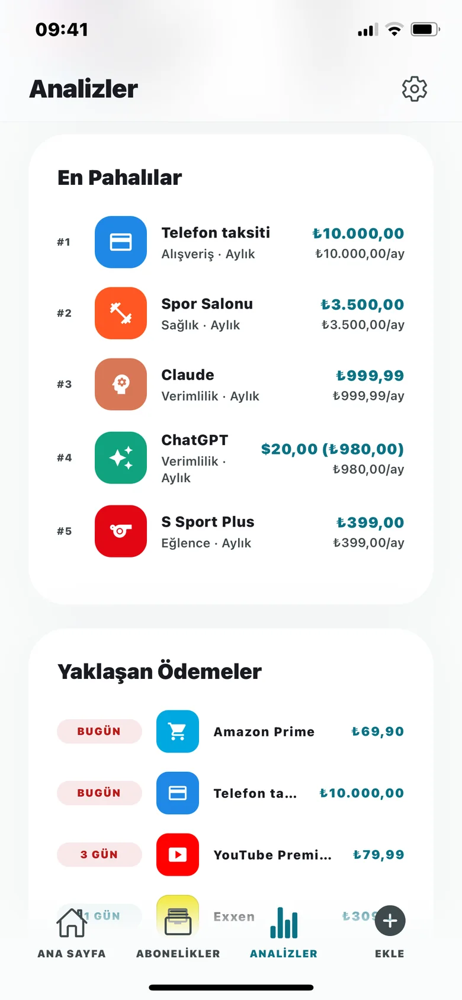
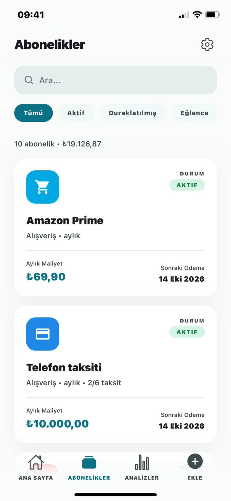
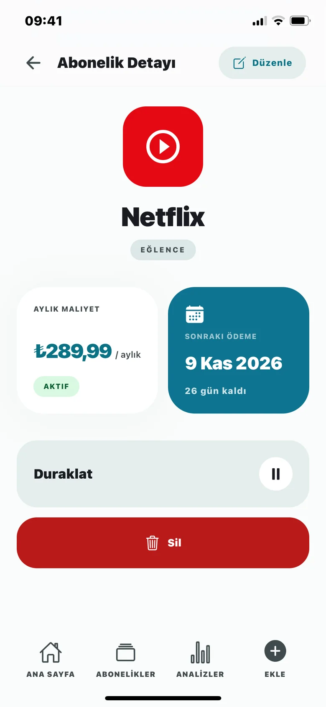

<div align="center">


# Subtification

**Aboneliklerin ve taksitlerin, tek bir yerde.**

Ne kadar harcadığını, sıradaki ödemenin ne zaman olduğunu ve paranın nereye gittiğini gösteren iOS uygulaması.

*An iOS app to track subscriptions and installments: monthly totals, payment calendar, budget and reminders.*

[](https://subtification.aruntas.com)
[](https://subtification.aruntas.com)


</div>

<p align="center">
  
  
  
  
</p>

## Özellikler

- **Hızlı ekleme:** Netflix, Spotify, iCloud+, ChatGPT gibi popüler servisler güncel planları
  ve fiyatlarıyla hazır. Listede olmayanı elle oluştur ya da birden fazla servisi toplu ekle.
- **Taksit ve süreli abonelik:** kaç taksit ödendiği, kaç ay kaldığı ve son ödeme tarihi.
- **Ödeme takvimi:** ay sonuna denk gelen tarihler dahil doğru hesaplanan sonraki ödemeler
  (31 Ocak → 28 Şubat → 31 Mart), ana sayfada aylık özet ve takvim şeridi.
- **Analiz ve bütçe:** abonelik ve kategori dağılımı, en pahalılar, aylık/yıllık harcama,
  bütçe limiti ve yıllık plana geçiş için tasarruf ipuçları.
- **Hatırlatmalar:** ödemeden önce yerel bildirim; gün (ödeme günü, 1/2/3 gün, 1 hafta önce)
  ve saat kullanıcı tarafından seçilir.
- **Çoklu para birimi:** ₺, $, €, £, ¥ ile kayıt; toplamlar güncel kurla TL'ye çevrilir.
- **Misafir modu:** hesap açmadan kullan; giriş yapınca verilerin hesabına taşınır.
- **Çevrimdışı:** internet yokken de ekle, düzenle, sil; değişiklikler kuyruğa alınır ve
  bağlantı gelince sırayla gönderilir.
- Açık/koyu/sistem teması, Türkçe ve İngilizce arayüz, uygulama içinden hesap silme.

<p align="center">
  
  
  
</p>

## Teknoloji

| | |
|---|---|
| Uygulama | [Expo](https://expo.dev) SDK 57 (dev client, CNG) · Expo Router · React Native Reanimated |
| Durum | Zustand · AsyncStorage (misafir verisi, çevrimdışı önbellek ve değişiklik kuyruğu) |
| Arka uç | [Supabase](https://supabase.com): e-posta/şifre ile giriş, Postgres, satır düzeyi güvenlik (RLS) |
| E-posta | Supabase Auth + [Resend](https://resend.com) SMTP, Türkçe HTML şablonlar |
| Kurlar | [frankfurter.app](https://www.frankfurter.app) (Avrupa Merkez Bankası referans kurları) |
| Çeviri | i18next (`locales/tr.json`, `locales/en.json`) |
| Web | Cloudflare Workers statik site: tanıtım, destek, gizlilik ve e-posta dönüş sayfası |
| Dağıtım | EAS Build + EAS Submit |

## Kurulum

1. Bağımlılıkları kur:

   ```bash
   npm install
   ```

2. Proje kökünde `.env` oluştur:

   ```env
   EXPO_PUBLIC_SUPABASE_URL=https://xxxx.supabase.co
   EXPO_PUBLIC_SUPABASE_ANON_KEY=sb_publishable_...
   ```

3. Supabase SQL Editor'da sırayla çalıştır:
   - `supabase/rebuild_backend_safe.sql`: tablo, RLS ve tetikleyiciler (mevcut veriyi silmez)
   - `supabase/migrations/*.sql`
   - `supabase/delete_account.sql`: uygulama içi hesap silme fonksiyonu

   E-posta şablonları `supabase/email-templates/` altında; Supabase panelinde
   *Authentication → Emails → Templates* bölümüne yapıştırılır.

4. Uygulamayı çalıştır. Proje dev client kullanıyor:

   ```bash
   eas build --profile development-simulator --platform ios
   npx expo start
   ```

   Yerelde derlemek için Xcode ve CocoaPods gerekir:

   ```bash
   npx expo run:ios
   ```

## Kontroller

```bash
npx tsc --noEmit
npx expo lint
```

Otomatik test altyapısı yok. Ödeme takvimi saf fonksiyonlardan oluştuğu için senaryolar
`node --experimental-strip-types` ile denenebilir.

## Proje yapısı

```
app/          Ekranlar (Expo Router): (auth) giriş akışı, (app) uygulama
components/   Ortak bileşenler, tab bar, ana sayfa kartları
constants/    Renkler, tipografi, kategoriler, popüler servisler ve fiyatları
hooks/        Tema ve para birimi hook'ları
lib/          Supabase istemcisi, ödeme takvimi, bildirimler, çevrimdışı kuyruk
stores/       Zustand store'ları (auth, abonelik, kur, bütçe, tema, onboarding)
locales/      tr.json, en.json
supabase/     SQL şeması, migration'lar, e-posta şablonları
web/          subtification.aruntas.com (tanıtım, destek, gizlilik, e-posta dönüş sayfası)
scripts/      Logo, ikon ve açılış ekranı görsellerini üreten betik
```

Geliştirme notları ve mimari kurallar için [CLAUDE.md](CLAUDE.md) dosyasına bak.

## İletişim

Sorun, öneri ya da hata bildirimi için: [support@aruntas.com](mailto:support@aruntas.com)

---

© 2026 Yusuf Erkam Aruntaş. Tüm hakları saklıdır. Kaynak kodu inceleme amacıyla açıktır;
izin alınmadan kopyalanamaz, değiştirilip dağıtılamaz ya da yayınlanamaz.
